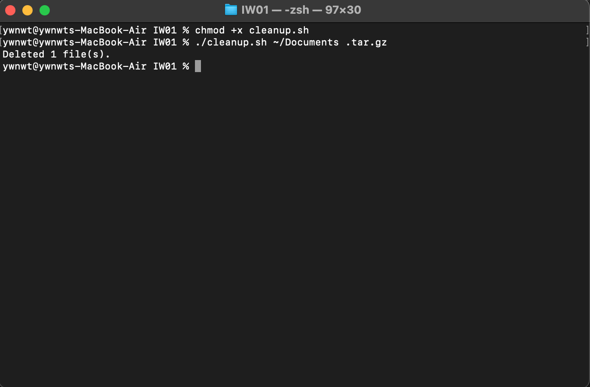
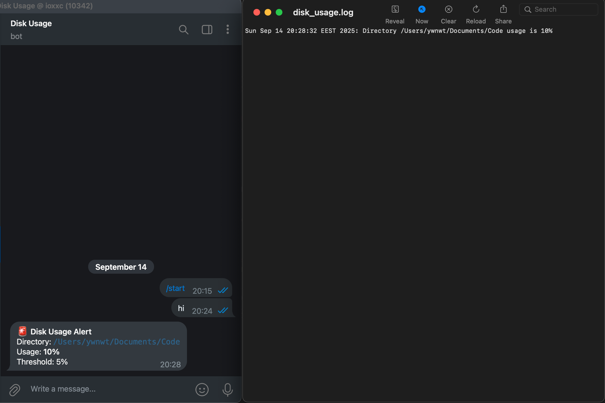
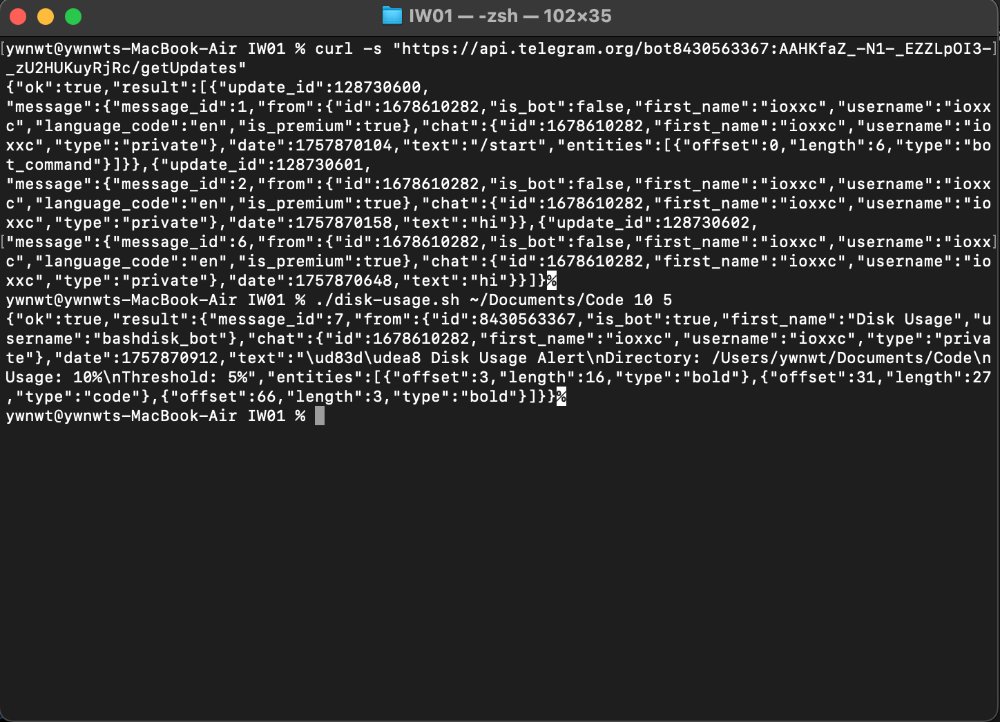

Fiecare cod bash incepe cu comanda "#!/bin/bash"

Sarcina 1
backup.sh este un cod care copiaza toate fisierele si directoarele intr-un .tar.gz respectiv daca v-om rula linia comanda data in screenshotul mai jos intr-un director care contine (ex. 2 fisiere), acesta va face un backup la (ex. 2 fisiere) in .tar.gz.

Sarcina 2
cleanup.sh este un cod care sterge toate fisierele si directoarele (la dorinta).
Ca exemplu v-om sterge backup-ul care l-am creeat in sarcina precedenta folosind cleanup.sh, utilizand urmatoarele linii de comanda.

Observam ca .tar.gz facut precedent este sters. Aceasta comanda poate fi utilizata cu orice tip de extensie (.txt, .zip, .rar, etc)

chmod +x cleanup.sh, l-am folosit pentru a face fisierul executabil.

Sarcina 3
disk-usage.sh verifică cât spațiu ocupă un director (folder) pe disc și trimite un avertisment (pe e-mail sau în terminal) dacă utilizarea spațiului depășește un anumit prag (în procente). De asemenea, salvează loguri despre utilizarea spațiului într-un fișier disk_usage.log.

Am implementat acest cod ca sa salveze un .log local, dar la fel sa trimita un mesaj printr-un bot de telegram, la user ID meu.

Observam ca a trimis un mesaj cu datele de usage si treshold si la fel a salvat un .log local.
