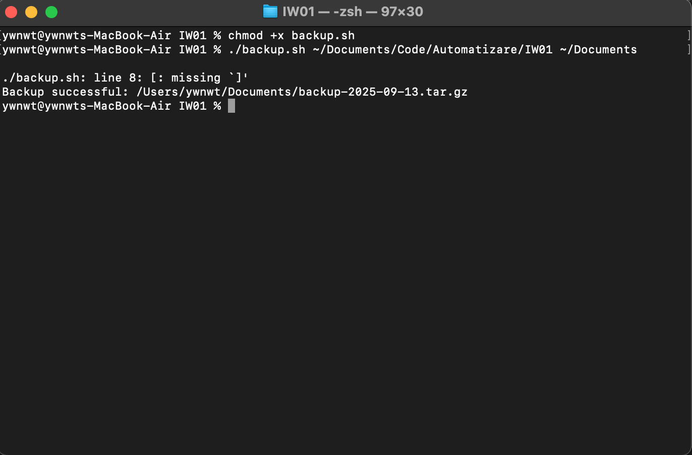
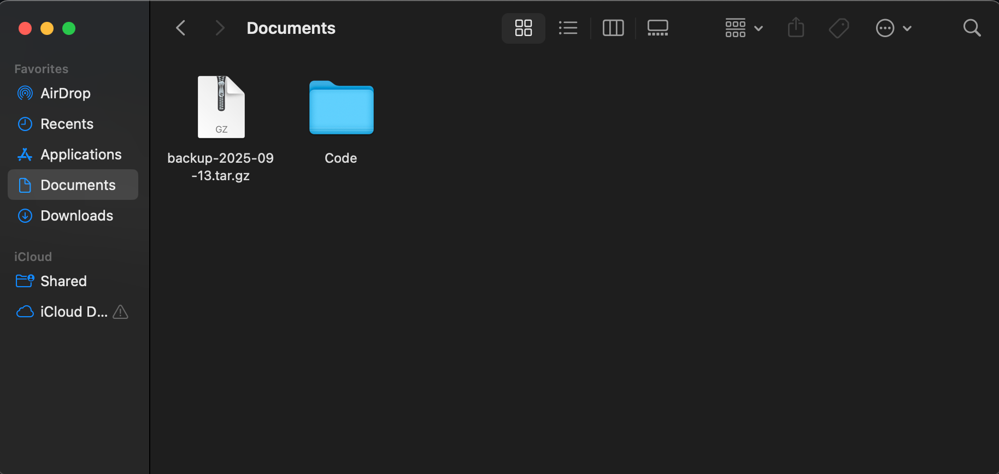

Fiecare cod bash incepe cu comanda "#!/bin/bash"

Sarcina 1
backup.sh este un cod care copiaza toate fisierele si directoarele intr-un .tar.gz respectiv daca v-om rula linia comanda data in screenshotul mai jos intr-un director care contine (ex. 2 fisiere), acesta va face un backup la (ex. 2 fisiere) in .tar.gz.

